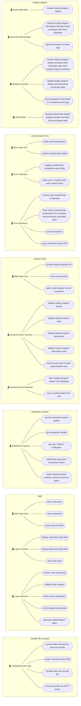

```mermaid
graph LR
    subgraph transfer file usecase
        style TF fill-opacity:0, stroke-opacity:0;
        direction LR  %%
        
        TF([fa:fa-user TransferConnect App]) --- B([receive daily command to send accrual file])
        TF([fa:fa-user TransferConnect App]) --- C([query TransferConnect DB])
        TF([fa:fa-user TransferConnect App]) --- D([compile data into accrual file])
        TF([fa:fa-user TransferConnect App]) --- E([send accrual file via SFTP server])


    end

    subgraph login
        style LU fill-opacity:0, stroke-opacity:0;
        style LS fill-opacity:0, stroke-opacity:0;
        style LI fill-opacity:0, stroke-opacity:0;
        direction LR  %%
        LU([fa:fa-user Bank App User]) --- childLU_1([enter username])
        LU([fa:fa-user Bank App User]) --- childLU_2([enter password])
        LU([fa:fa-user Bank App User]) --- childLU_3([press submit button])

        LI([fa:fa-user Login Interface]) --- childLI_1([display username input field])
        LI([fa:fa-user Login Interface]) --- childLI_2([display password input field])
        LI([fa:fa-user Login Interface]) --- childLI_3([store user input])

        LS([fa:fa-user Login Backend]) --- childLS_1([receive user credentials])
        LS([fa:fa-user Login Backend]) --- childLS_2([validate login request])
        LS([fa:fa-user Login Backend]) --- childLS_3([fetch stored credentials])
        LS([fa:fa-user Login Backend]) --- childLS_4([verify inputted credentials])
        LS([fa:fa-user Login Backend]) --- childLS_5([generate authentication token])
    end

    subgraph notification system
        style NS fill-opacity:0, stroke-opacity:0;
        direction LR  %%
        NS([fa:fa-user Notification System]) --- childNS_0([receive transaction status update])
        NS([fa:fa-user Notification System]) --- childNS_1([get transaction details])
        NS([fa:fa-user Notification System]) --- childNS_2([get user mode of notification])
        NS([fa:fa-user Notification System]) --- childNS_3([notify Bank App about transaction status])
        NS([fa:fa-user Notification System]) --- childNS_4([notify registered bank customer about transaction status])
    end

    subgraph reward center
        style RC fill-opacity:0, stroke-opacity:0;
        direction LR  %%
        RC([fa:fa-user Bank App User]) --- childRC_2([browse loyalty program list])
        RC([fa:fa-user Bank App User]) --- childRC_3([see current points])
        RC([fa:fa-user Bank App User]) --- childRC_4([open credit transfer form of a program])

        style LPM fill-opacity:0, stroke-opacity:0;
        LPM([fa:fa-user Reward Center Interface]) --- childLPM_1([display loyalty program names])
        LPM([fa:fa-user Reward Center Interface]) --- childLPM_2([display loyalty program rates])
        LPM([fa:fa-user Reward Center Interface]) --- childLPM_3([display loyalty program description])
        LPM([fa:fa-user Reward Center Interface]) --- childLPM_4([display loyalty program information links])
        LPM([fa:fa-user Reward Center Interface]) --- childLPM_5([receive user input to open credit transfer form])

        style RCS fill-opacity:0, stroke-opacity:0;
        RCS([fa:fa-user Reward Center Backend]) --- childRCS_1([fetch loyalty program details from database])
        RCS([fa:fa-user Reward Center Backend]) --- childRCS_2([query credit transfer form API])


        
    end

    subgraph credit transfer form

        style PTC fill-opacity:0, stroke-opacity:0;
        
        direction LR  %%
        PTC([fa:fa-user Bank App User]) --- childPTC_1([make point transactions])
        PTC([fa:fa-user Bank App User]) --- childPTC_2([submit membership details])

        style FI fill-opacity:0, stroke-opacity:0;
        FI([fa:fa-user Form Interface]) --- childFI_1([display membership credentials input fields])
        FI([fa:fa-user Form Interface]) --- childFI_3([allow user to submit form with submit button])

        style CF fill-opacity:0, stroke-opacity:0;
        CF([fa:fa-user Form Backend]) --- childCF_1([receive new membership credentials])
        CF([fa:fa-user Form Backend]) --- childCF_2([fetch stored membership credentials if the customer had previously submitted them])
        CF([fa:fa-user Form Backend]) --- childCF_4([post transactions])
        CF([fa:fa-user Form Backend]) --- childCF_3([query TransferConnect API])
    end

    subgraph loyalty program

        style LP_A fill-opacity:0, stroke-opacity:0;
        style LP_B fill-opacity:0, stroke-opacity:0;
        style LP_C fill-opacity:0, stroke-opacity:0;
        style LP_D fill-opacity:0, stroke-opacity:0;
        direction LR  %%
        LP_A([fa:fa-user Bank Application]) --- childLP_1([request loyalty program details])
        LP_B([fa:fa-user Ascenda Administrator]) --- childLP_B1([request loyalty program information and bank point exchange rates from database])
        LP_B([fa:fa-user Ascenda Administrator]) --- childLP_B2([parse information to Bank App])
        LP_C([fa:fa-user Database System]) --- childLP_C1([receive loyalty program details and bank point exchange rates from loyalty program providers ])
        LP_C([fa:fa-user Database System]) --- childLP_C2([update loyalty program details and bank point exchange rates])
        LP_C([fa:fa-user Database System]) --- childLP_C3([send requested information to TransferConnect app])
        LP_D([fa:fa-user Client Bank]) --- childLP_4([provide partnership loyalty program details and bank point exchange rates])
    end


```
