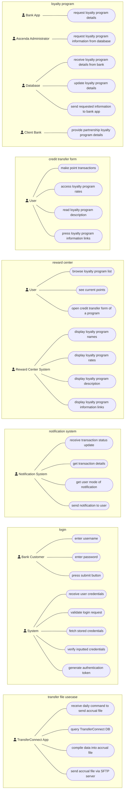

```mermaid
graph LR
    subgraph transfer file usecase
        style TF fill-opacity:0, stroke-opacity:0;
        direction LR  %%
        
        TF([fa:fa-user TransferConnect App]) --- B([receive daily command to send accrual file])
        TF([fa:fa-user TransferConnect App]) --- C([query TransferConnect DB])
        TF([fa:fa-user TransferConnect App]) --- D([compile data into accrual file])
        TF([fa:fa-user TransferConnect App]) --- E([send accrual file via SFTP server])
    end

    subgraph login
        style LU fill-opacity:0, stroke-opacity:0;
        style LS fill-opacity:0, stroke-opacity:0;
        direction LR  %%
        LU([fa:fa-user Bank Customer]) --- childLU_1([enter username])
        LU([fa:fa-user Bank Customer]) --- childLU_2([enter password])
        LU([fa:fa-user Bank Customer]) --- childLU_3([press submit button])

        LS([fa:fa-user System]) --- childLS_1([receive user credentials])
        LS([fa:fa-user System]) --- childLS_2([validate login request])
        LS([fa:fa-user System]) --- childLS_3([fetch stored credentials])
        LS([fa:fa-user System]) --- childLS_4([verify inputted credentials])
        LS([fa:fa-user System]) --- childLS_5([generate authentication token])
    end

    subgraph notification system
        style NS fill-opacity:0, stroke-opacity:0;
        direction LR  %%
        NS([fa:fa-user Notification System]) --- childNS_4([receive transaction status update])
        NS([fa:fa-user Notification System]) --- childNS_1([get transaction details])
        NS([fa:fa-user Notification System]) --- childNS_2([get user mode of notification])
        NS([fa:fa-user Notification System]) --- childNS_3([send notification to user])
    end

    subgraph reward center
        style RC fill-opacity:0, stroke-opacity:0;
        direction LR  %%
        RC([fa:fa-user User]) --- childRC_2([browse loyalty program list])
        RC([fa:fa-user User]) --- childRC_3([see current points])
        RC([fa:fa-user User]) --- childRC_4([open credit transfer form of a program])

        style LPM fill-opacity:0, stroke-opacity:0;
        direction LR  %%
        LPM([fa:fa-user Reward Center System]) --- childLPM_1([display loyalty program names])
        LPM([fa:fa-user Reward Center System]) --- childLPM_2([display loyalty program rates])
        LPM([fa:fa-user Reward Center System]) --- childLPM_3([display loyalty program description])
        LPM([fa:fa-user Reward Center System]) --- childLPM_4([display loyalty program information links])

        
    end

    subgraph credit transfer form

        style PTC fill-opacity:0, stroke-opacity:0;
        direction LR  %%
        PTC([fa:fa-user User]) --- childPTC_1([make point transactions])
        PTC([fa:fa-user User]) --- childPTC_2([access loyalty program rates])
        PTC([fa:fa-user User]) --- childPTC_3([read loyalty program description])
        PTC([fa:fa-user User]) --- childPTC_4([press loyalty program information links])
    end

    subgraph loyalty program

        style LP_A fill-opacity:0, stroke-opacity:0;
        style LP_B fill-opacity:0, stroke-opacity:0;
        style LP_C fill-opacity:0, stroke-opacity:0;
        style LP_D fill-opacity:0, stroke-opacity:0;
        direction LR  %%
        LP_A([fa:fa-user Bank App]) --- childLP_1([request loyalty program details])
        LP_B([fa:fa-user Ascenda Administrator]) --- childLP_2([request loyalty program information from database])
        LP_C([fa:fa-user Database]) --- childLP_C1([receive loyalty program details from bank])
        LP_C([fa:fa-user Database]) --- childLP_C2([update loyalty program details])
        LP_C([fa:fa-user Database]) --- childLP_C3([send requested information to bank app])
        LP_D([fa:fa-user Client Bank]) --- childLP_4([provide partnership loyalty program details])
    end


```
