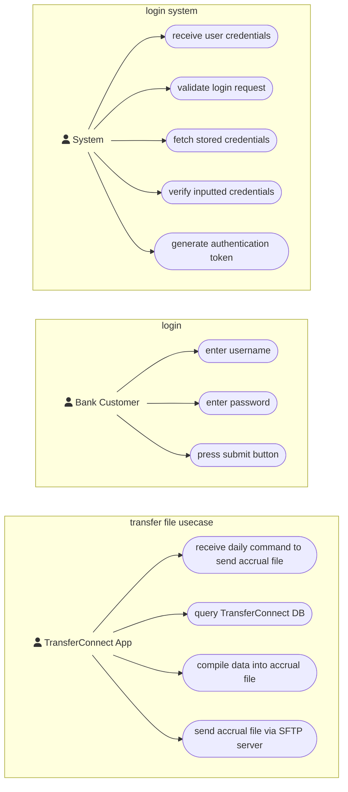

<!-- transfer file use case -->

```mermaid
graph LR
    subgraph transfer file usecase
        style A fill-opacity:0, stroke-opacity:0;
        direction LR  %%
        A([fa:fa-user TransferConnect App]) --> B([receive daily command to send accrual file])
        A([fa:fa-user TransferConnect App]) --> C([query TransferConnect DB])
        A([fa:fa-user TransferConnect App]) --> D([compile data into accrual file])
        A([fa:fa-user TransferConnect App]) --> E([send accrual file via SFTP server])
    end

    subgraph login
        style X fill-opacity:0, stroke-opacity:0;
        direction LR  %%
        X([fa:fa-user Bank Customer]) --> childX_1([enter username])
        X([fa:fa-user Bank Customer]) --> childX_2([enter password])
        X([fa:fa-user Bank Customer]) --> childX_3([press submit button])
    end

    subgraph login system
        style BS fill-opacity:0, stroke-opacity:0;
        direction LR  %%
        BS([fa:fa-user System]) --> childBS_1([receive user credentials])
        BS([fa:fa-user System]) --> childBS_2([validate login request])
        BS([fa:fa-user System]) --> childBS_3([fetch stored credentials])
        BS([fa:fa-user System]) --> childBS_4([verify inputted credentials])
        BS([fa:fa-user System]) --> childBS_5([generate authentication token])
    end
```
