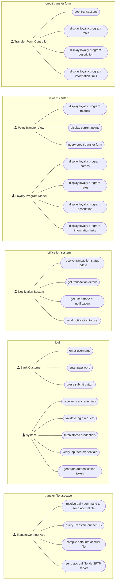

```mermaid
graph LR
    subgraph transfer file usecase
        style TF fill-opacity:0, stroke-opacity:0;
        direction LR  %%
        
        TF([fa:fa-user TransferConnect App]) --- B([receive daily command to send accrual file])
        TF([fa:fa-user TransferConnect App]) --- C([query TransferConnect DB])
        TF([fa:fa-user TransferConnect App]) --- D([compile data into accrual file])
        TF([fa:fa-user TransferConnect App]) --- E([send accrual file via SFTP server])
    end

    subgraph login
        style LU fill-opacity:0, stroke-opacity:0;
        style LS fill-opacity:0, stroke-opacity:0;
        direction LR  %%
        LU([fa:fa-user Bank Customer]) --- childLU_1([enter username])
        LU([fa:fa-user Bank Customer]) --- childLU_2([enter password])
        LU([fa:fa-user Bank Customer]) --- childLU_3([press submit button])

        LS([fa:fa-user System]) --- childLS_1([receive user credentials])
        LS([fa:fa-user System]) --- childLS_2([validate login request])
        LS([fa:fa-user System]) --- childLS_3([fetch stored credentials])
        LS([fa:fa-user System]) --- childLS_4([verify inputted credentials])
        LS([fa:fa-user System]) --- childLS_5([generate authentication token])
    end

    subgraph notification system
        style NS fill-opacity:0, stroke-opacity:0;
        direction LR  %%
        NS([fa:fa-user Notification System]) --- childNS_4([receive transaction status update])
        NS([fa:fa-user Notification System]) --- childNS_1([get transaction details])
        NS([fa:fa-user Notification System]) --- childNS_2([get user mode of notification])
        NS([fa:fa-user Notification System]) --- childNS_3([send notification to user])
    end

    subgraph reward center
        style RC fill-opacity:0, stroke-opacity:0;
        direction LR  %%
        RC([fa:fa-user Point Transfer View]) --- childRC_1([display loyalty program models])
        RC([fa:fa-user Point Transfer View]) --- childRC_2([display current points])
        RC([fa:fa-user Point Transfer View]) --- childRC_3([query credit transfer form])

        style LPM fill-opacity:0, stroke-opacity:0;
        direction LR  %%
        LPM([fa:fa-user Loyalty Program Model]) --- childLPM_1([display loyalty program names])
        LPM([fa:fa-user Loyalty Program Model]) --- childLPM_2([display loyalty program rates])
        LPM([fa:fa-user Loyalty Program Model]) --- childLPM_3([display loyalty program description])
        LPM([fa:fa-user Loyalty Program Model]) --- childLPM_4([display loyalty program information links])

        
    end

    subgraph credit transfer form

        style PTC fill-opacity:0, stroke-opacity:0;
        direction LR  %%
        PTC([fa:fa-user Transfer Form Controller]) --- childPTC_1([post transactions])
        PTC([fa:fa-user Transfer Form Controller]) --- childPTC_2([display loyalty program rates])
        PTC([fa:fa-user Transfer Form Controller]) --- childPTC_3([display loyalty program description])
        PTC([fa:fa-user Transfer Form Controller]) --- childPTC_4([display loyalty program information links])
    end


```
