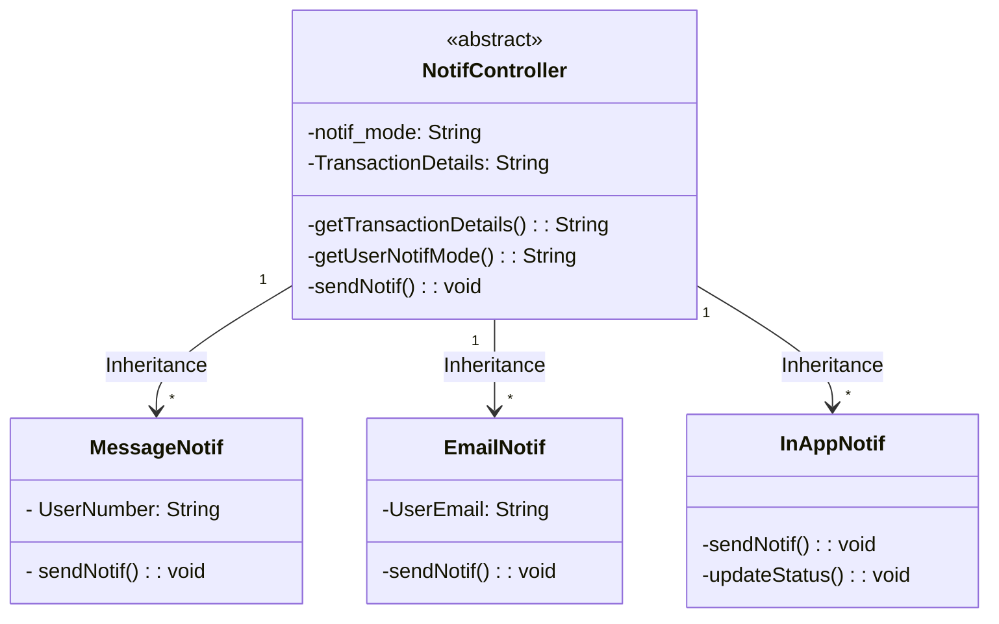
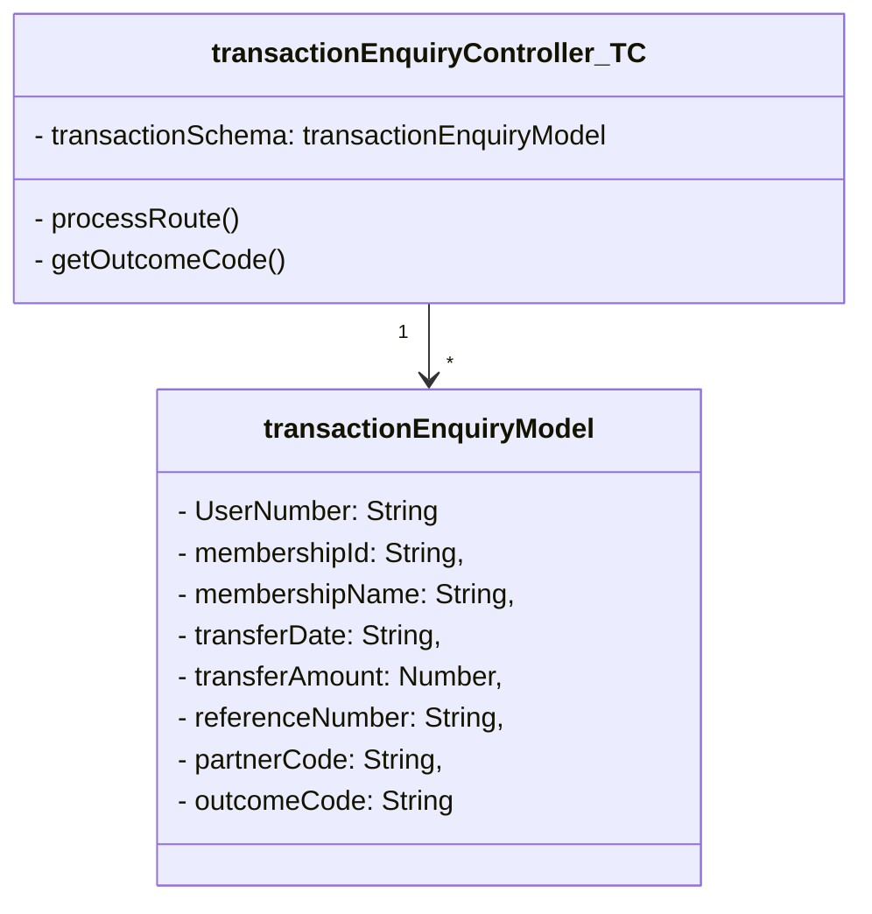

```Mermaid

sequenceDiagram
    TransactionEnquiryAPI -->> NotifController: TransactionStatus_Updated == True
    activate NotifController
    NotifController -) NotifController:getTransactionDetails()
    deactivate NotifController
    
    activate NotifController
    NotifController -) NotifController:getUserNotifMode()
    NotifController -) User: sendNotif()
    deactivate NotifController

```

```Mermaid
classDiagram
class transactionEnquiryController_BA
transactionEnquiryController_BA"1" --> "*"transactionEnquiryModel


class transactionEnquiryController_BA{
    - transactionSchema: transactionEnquiryModel
    - startEnquiry()
    - getReferenceNumbers()
    - makeApiRequest()
    - updateOutcomeCodes()
}

class transactionEnquiryModel{
    - UserNumber: String
    - membershipId: String,
    - membershipName: String,
    - transferDate: String,
    - transferAmount: Number,
    - referenceNumber: String,
    - partnerCode: String,
    - outcomeCode: String
}
```

```Mermaid

sequenceDiagram
    activate Bank-App
    Bank-App -) Bank-App: getReferenceNumbers()
    Bank-App -->> TransferConnect: makeApiRequest()
    deactivate Bank-App
    activate TransferConnect
    TransferConnect -) TransferConnect: processRoute()
    deactivate TransferConnect
    activate TransferConnect
    TransferConnect -) TransferConnect: getOutcomeCode()
    TransferConnect -->> Bank-App: return
    deactivate TransferConnect
    activate Bank-App
    Bank-App -) Bank-App: updateOutcomeCodes()
    deactivate Bank-App
   

