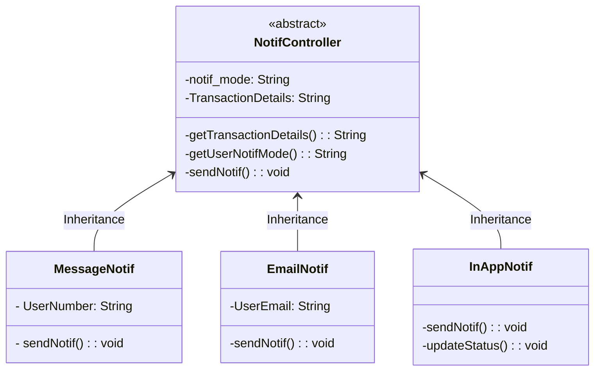

```Mermaid

sequenceDiagram
    TransactionEnquiryAPI -->> NotifController: TransactionStatus_Updated == True
    activate NotifController
    NotifController -) NotifController:getTransactionDetails()
    deactivate NotifController
    
    activate NotifController
    NotifController -) NotifController:getUserNotifMode()
    NotifController -) User: sendNotif()
    deactivate NotifController


